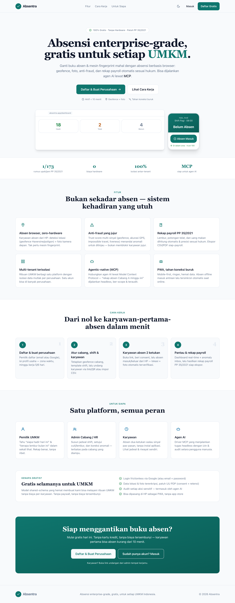
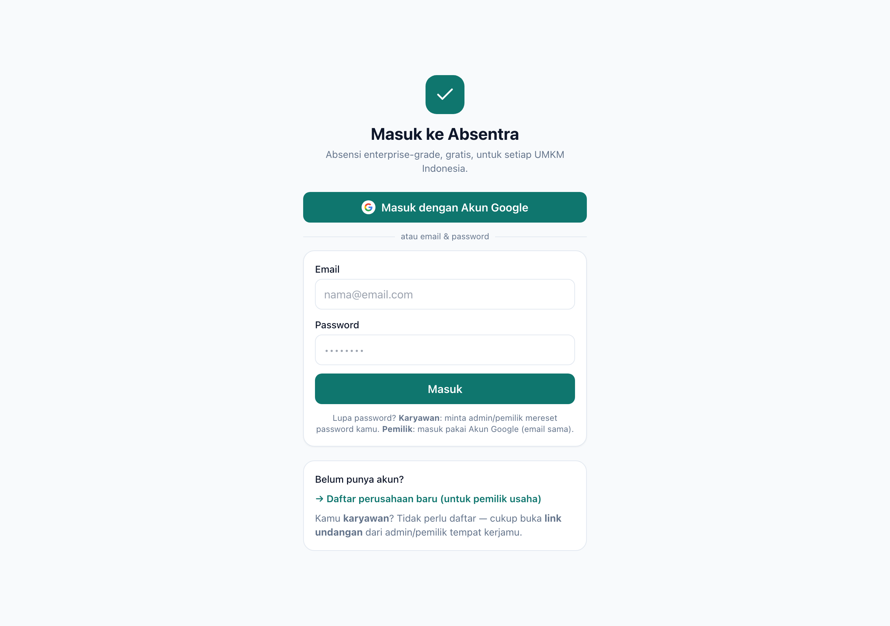
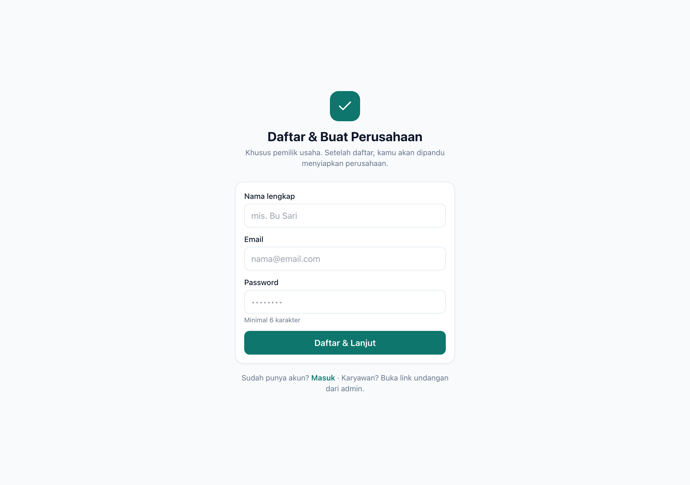

# Absentra — Attendance SaaS untuk UMKM Indonesia

> **Portfolio showcase.** Ini etalase publik dari **Absentra**, sebuah aplikasi absensi B2B multi-tenant yang saya rancang & bangun *full-stack*. Source code lengkap berada di repositori privat — di sini saya tampilkan ringkasan produk, screenshot, arsitektur, dan beberapa potongan kode inti yang paling menarik.

Absentra menggantikan buku absen manual & mesin fingerprint mahal dengan **satu sistem berbasis browser**: absen tanpa hardware (Geolocation + kamera HTML5), anti-fraud berbasis *trust score*, dan mesin rekap payroll yang mengkodekan hukum lembur Indonesia (**PP 35/2021**). Dirancang **agentic-native** — setiap kemampuan tersedia lewat UI web *dan* lewat **MCP server** sehingga bisa dijalankan agen AI secara headless.

🟢 **100% gratis** · 📱 **Web-only PWA (mobile-first)** · 🏢 **Multi-tenant** · 🤖 **MCP / agentic**

---

## ✨ Tampilan

### Landing page


### Masuk & Daftar
<p align="center">
  
  
</p>

---

## 🎯 Masalah yang dipecahkan

UMKM Indonesia mencatat kehadiran dengan buku tulis, spreadsheet, atau mesin fingerprint yang mahal dan ribet. Akibatnya: rekap absen tidak akurat, perhitungan lembur keliru (rawan sengketa), dan tidak ada visibilitas real-time. Absentra memberi sistem kehadiran **kelas enterprise yang gratis** dan cukup ringan untuk HP murah dengan koneksi pas-pasan.

## 🧩 Fitur inti

| Modul | Ringkasan |
|---|---|
| **Absen zero-hardware** | Clock-in/out dari browser HP: deteksi lokasi (geofence) + foto kamera depan. FSM eksplisit dengan state `Idle → Locating → Capturing → Reviewing → Submitting → Success/Queued`. |
| **Anti-fraud jujur** | *Trust score* 0–100 dari banyak sinyal (geofence, akurasi GPS, *impossible travel*, *device fingerprint*, liveness). Menandai anomali untuk ditinjau manusia — **bukan memblokir** karyawan jujur. |
| **Payroll PP 35/2021** | Mesin deterministik: `upah/jam = upah bulanan / 173`, pengali lembur per jenis hari × tipe minggu kerja, potongan telat, uang makan. Ekspor CSV/XLSX/PDF. |
| **Multi-tenant terisolasi** | `company_id` di setiap baris, scoping per query, dirancang ke arah Postgres **RLS** `FORCE`. Satu identitas bisa jadi Owner di satu UMKM & Karyawan di UMKM lain — tanpa kebocoran. |
| **RBAC ber-scope** | Lima peran (Operator, Owner, Branch Admin, HR/Approver, Karyawan). Satu fungsi `can(actor, capability, resource)` menjaga **semua** endpoint REST & tool MCP. |
| **Agentic (MCP)** | MCP server = adapter tipis di atas Core API (parity, satu jalur otorisasi). Aksi sensitif butuh konfirmasi *human-in-the-loop*; setiap tool-call ter-audit. |
| **PWA & offline** | Mobile-first, hemat data, antrean absen offline (IndexedDB + Background Sync) dengan *idempotency key* anti-duplikat. |

## 🏗️ Arsitektur

```
┌──────────────────────────┐        ┌──────────────────────────┐
│  Web PWA (React + TS)     │        │  Agen AI (klien MCP)      │
│  Vite · Tailwind · TanStack│       │  OAuth 2.1 · scope-bound  │
└────────────┬─────────────┘        └────────────┬─────────────┘
             │  REST                              │  MCP (JSON-RPC)
             └───────────────┬────────────────────┘
                             ▼
              ┌────────────────────────────────┐
              │  Core API (Node + Express)      │
              │  • can(actor, capability)  ◄── satu jalur otorisasi
              │  • tenant scoping (company_id)  │
              │  • audit log (append-only)      │
              │  • domain engines (pure)        │
              └───────────────┬────────────────┘
                              ▼
                  SQLite (stand-in) → Postgres + RLS
```

**Prinsip non-negotiable** yang dipegang sepanjang kode:
1. **Isolasi tenant itu sakral** — setiap baris ber-`company_id`, setiap query di-scope, RLS sebagai lapis pertahanan terakhir.
2. **Satu jalur otorisasi** — UI & agen AI memakai `can()` yang sama; tidak ada jalur istimewa untuk agen.
3. **Kebenaran regulasi** — math payroll mengikuti PP 35/2021; tidak di-*hand-roll*.
4. **Privasi (UU PDP)** — lokasi & foto = data sensitif → consent eksplisit, minimisasi, enkripsi, retensi terkonfigurasi, audit setiap akses.
5. **Trust, jangan blokir** — anti-fraud menaikkan biaya kecurangan & menandai anomali, bukan menghukum pekerja jujur.

## 🛠️ Tech stack

**Frontend:** React 18 · TypeScript · Vite · Tailwind · TanStack Query · Zustand · React Router · Vitest · PWA
**Backend:** Node · Express · better-sqlite3 (stand-in Postgres+RLS) · Zod · sesi cookie httpOnly + rotasi refresh-token · Google OAuth (OIDC) · MCP (JSON-RPC 2.0, OAuth 2.1)
**Domain:** mesin murni & teruji untuk payroll, geofence, trust scoring, FSM clock-in, dan RBAC.

## 🔬 Sorotan kode

Beberapa mesin domain **murni & teruji** ada di [`code-highlights/domain/`](code-highlights/domain/):

- [`payroll.ts`](code-highlights/domain/payroll.ts) — mesin rekap PP 35/2021 (pengali lembur per jenis hari × tipe minggu kerja, potongan telat, uang makan).
- [`payroll.test.ts`](code-highlights/domain/payroll.test.ts) — termasuk *verified example*: upah Rp4.000.000 → 2 jam lembur hari kerja ≈ **Rp80.924**.
- [`geofence.ts`](code-highlights/domain/geofence.ts) — Haversine (lingkaran) + ray-casting (poligon).
- [`trust.ts`](code-highlights/domain/trust.ts) — agregasi sinyal berbobot → skor + ambang batas.
- [`rbac.ts`](code-highlights/domain/rbac.ts) — `can(actor, capability, resource)` + matriks kapabilitas.

> Contoh kebenaran lembur hari kerja: `OT = 1.5·hw·min(h,1) + 2·hw·max(h−1,0)`.

## 📐 Design system

UI dibangun dari design system khusus (token warna, tipografi, spacing, komponen, spec layar) — lihat [`design-system.md`](design-system.md). Mobile-first & *performance-first* untuk HP murah: *system font stack* (hemat data), target sentuh ≥ 44px, status tidak pernah hanya-warna (a11y buta-warna), baseline **WCAG 2.2 AA**, mode terang/gelap.

## 📦 Status

Aplikasi **full-stack yang bisa dijalankan**: Owner mendaftar → wizard onboarding → kelola perusahaan/cabang+geofence/divisi/shift/karyawan/peran/kebijakan; karyawan bergabung via link/QR + consent lalu absen. Auth fungsional (akun & sesi nyata, Google OAuth nyata). Diuji terhadap rencana pengujian black-box (**155 butir uji lulus**).

---

<sub>© 2026 — dibuat oleh <a href="https://github.com/adzkiyaqarina">@adzkiyaqarina</a>. Repositori ini adalah etalase portofolio; implementasi lengkap bersifat privat. Hak cipta dipertahankan.</sub>
